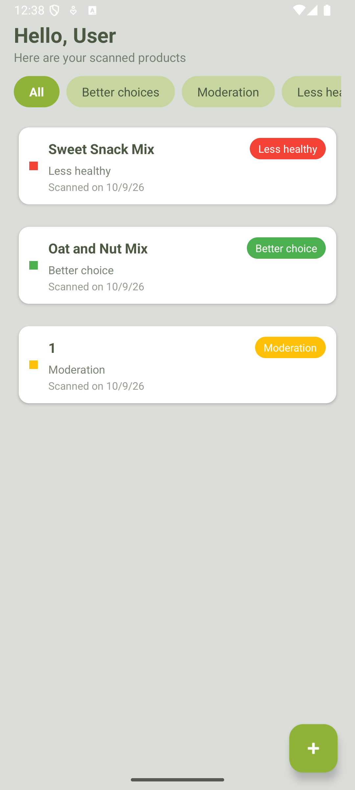
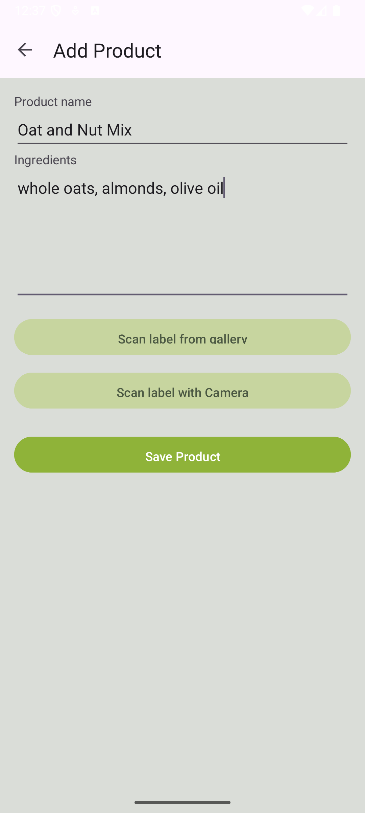
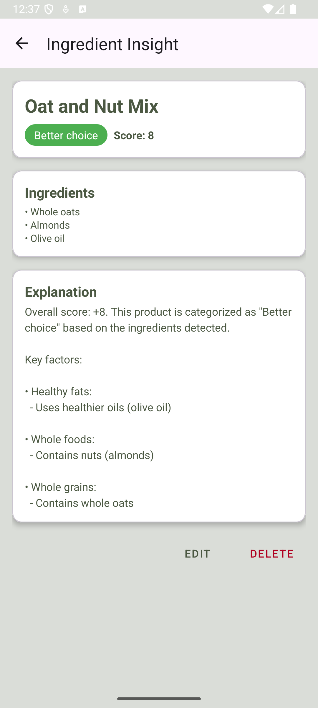

# Ingredient Insight

An Android app that turns ingredient labels into editable text, applies a transparent set of scoring rules, and saves the results for later review.

Built for a **mobile app software development course in 2025**, Ingredient Insight connects camera input, on-device text recognition, a local database, and a multi-screen interface into a complete product workflow.

> **Educational prototype:** the ingredient scores and labels come from custom keyword rules. They are not a validated nutrition assessment or medical advice.

## App preview

Screenshots from the running Android app. The named demo products use manually entered ingredients to make the scoring behavior easy to reproduce.

| Saved products and filters | Add a product | Ingredients and explanation |
| :---: | :---: | :---: |
|  |  |  |

## Features

- **Camera scanning:** recognize label text from a live CameraX preview using Google ML Kit.
- **Gallery scanning:** select a label image through Android's document picker and extract its text.
- **Manual input and correction:** enter a product name and edit recognized ingredients before saving.
- **Ingredient analysis:** calculate a score, assign a category, and explain the matching rules.
- **Local storage:** save products in a Room database and reload them when returning to the app.
- **Product management:** view, edit, and delete saved products; editing recalculates the analysis.
- **Category filters:** browse all products or filter by “Better choice,” “Moderation,” and “Less healthy.”

There is no account, remote product database, or backend service. The app does not declare an internet permission.

## Technology

| Area | Implementation |
| --- | --- |
| App code | Java; Java 11 source and target compatibility |
| Interface | XML layouts, AppCompat, Material Components, RecyclerView |
| Camera | CameraX 1.3.3 |
| Text recognition | Google ML Kit Text Recognition 16.0.1, Latin script |
| Persistence | Room 2.6.1 |
| Build | Gradle 8.13, Android Gradle Plugin 8.12.3, Kotlin DSL build files |
| Android support | Android 13 / API 33 or newer; compile and target SDK 36 |
| Unit tests | JUnit 4 |

The Kotlin DSL is used for build configuration; the app itself is written in Java.

## How it works

1. Open **Add Product** from the home screen.
2. Enter ingredients, scan a gallery image, or open the camera and tap the scan button.
3. Review the extracted text and correct OCR errors.
4. Save the product. The analyzer returns the score, label, and explanation, which are stored with the product.
5. Open the saved product to review its analysis, edit it, or delete it.

The code is organized into three packages rather than a full MVVM architecture:

```text
view/   Activities, product list adapter, camera and gallery workflows
model/  Product and ScanEntry entities, standalone IngredientAnalyzer
data/   Room database and data access interfaces
```

Activities coordinate input and persistence. Room operations run on background threads, and interface updates return to the main thread. `IngredientAnalyzer` is independent of Android APIs, so its behavior can be tested with local JVM tests.

## Scoring behavior

The analyzer lowercases the input, splits it on commas, semicolons, and parentheses, and searches each segment for keyword rules using word boundaries. The **first matching rule** for each segment contributes its weight to an integer score. Explanation messages are grouped by category and displayed in alphabetical category order.

| Score | App label |
| --- | --- |
| 5 or above | Better choice |
| −4 through 4 | Moderation |
| −5 or below | Less healthy |
| Empty or missing input | Unknown |

The score is an unbounded sum, **not a percentage or a rating out of 10**.

Reproducible examples:

| Ingredients | Score | Label |
| --- | --- | --- |
| `whole oats, almonds, olive oil` | +8 | Better choice |
| `quinoa, olive oil, sugar` | +3 | Moderation |
| `sugar, wheat flour, soybean oil` | −8 | Less healthy |

## Run locally

### Android Studio

1. Clone this repository:

   ```sh
   git clone https://github.com/kamhyles/ingredient-insight.git
   ```

2. Open the **`Ingredientinsight/`** folder in Android Studio and let Gradle sync.
3. Install Android SDK Platform **36** and the required SDK build tools through SDK Manager.
4. Use **JDK 17 or 21** for Gradle. Java 11 is the app's source compatibility setting, not the JDK required to run the build.
5. Select an Android 13+ device or emulator and run the `app` configuration. Camera scanning requests camera permission at runtime.

### VS Code or a terminal

You can edit the same project in VS Code and use the Gradle wrapper to build it. The app opens on an Android emulator or connected device.

Set `JAVA_HOME` to a suitable JDK, and make the Android SDK discoverable using `ANDROID_HOME` or a local, untracked `Ingredientinsight/local.properties` file containing `sdk.dir=/absolute/path/to/your/android/sdk`. Add the SDK's `platform-tools` directory to `PATH` for `adb`.

```sh
cd Ingredientinsight
./gradlew :app:assembleDebug

# With an emulator running or a device connected:
./gradlew :app:installDebug
adb shell am start -n com.example.ingredientinsight/.view.HomeActivity
```

The debug APK is written to `Ingredientinsight/app/build/outputs/apk/debug/app-debug.apk`. On Windows, use `gradlew.bat` instead of `./gradlew`. If several devices are connected, choose one with `adb -s SERIAL` and install the APK directly on that device.

See the official [Android command-line build guide](https://developer.android.com/build/building-cmdline) for SDK and device setup.

## Try the label images

The four original label images in [`test_images/`](test_images/) are **manual OCR fixtures**. A folder on your computer does not automatically appear in an emulator's gallery.

With Python 3 installed, an emulator running, and `adb` on `PATH`, run this from the repository root:

```sh
python3 scripts/load_test_images.py

# If several devices are connected:
python3 scripts/load_test_images.py --serial emulator-5554

# If adb is not on PATH, supply its full path:
python3 scripts/load_test_images.py --adb /path/to/android/sdk/platform-tools/adb
```

The script copies the images into `Pictures/IngredientInsightTests/` on the selected device and requests media indexing. In the app, tap **+ → Scan label from gallery**, then select an image from **Recent** or **Images → IngredientInsightTests**. Close and reopen an already-open picker if necessary.

OCR may include package headings, nutrition text, or misread characters. Correct the ingredient field before saving; the app currently analyzes whatever text is in that field.

## Tests and validation

Run the local tests and build from the Android project folder:

```sh
cd Ingredientinsight
./gradlew :app:testDebugUnitTest :app:assembleDebug
```

The 16 analyzer tests cover missing input, category boundaries, mixed positive and negative scores, case handling, word boundaries, ingredient separators, explanation ordering, and current rule-order and duplicate-ingredient limitations. They verify software behavior; they do not establish the scientific validity of the scoring rules.

GitHub Actions runs the analyzer tests and debug build on pushes and pull requests. Camera, gallery OCR, and database workflows still require device testing. The included Android instrumentation test is the original project template test, not a complete UI test suite.

During repository preparation, the debug build and all analyzer tests passed locally, and the app was installed and launched on an API 36 emulator. Gallery recognition was also exercised manually using the supplied label images.

## Known limitations and future work

- **Scoring is heuristic:** ingredient quantities, nutrition facts, serving size, allergies, and individual dietary needs are not modeled. The weights are not scientifically validated.
- **Rule order matters:** only the first match in each segment counts. For example, `whole grain wheat flour` currently matches the earlier refined-flour rule.
- **Duplicates affect scores:** repeating an ingredient adds its weight again, even though explanation messages are deduplicated.
- **Unrecognized input can look neutral:** a nonempty list with no recognized ingredients receives a score of zero and the “Moderation” label.
- **OCR needs review:** the app does not isolate the ingredients section, normalize all recognition errors, or show a live recognized-text overlay in the camera screen.
- **Persistence is basic:** schema changes use destructive migration. Product images are not saved, and the `ScanEntry` entity/DAO exists but is not connected to a scan-history workflow.
- **Lifecycle and UI work remains:** activities manage background threads directly; automated device tests, error handling, accessibility, and broader screen-size coverage can be improved.

Useful next steps would be improving rule specificity and duplicate handling, adding database migrations and device tests, and replacing the experimental health labels with an evidence-based or explicitly descriptive ingredient classification.

## Course context and attribution

This repository preserves a 2025 mobile app course project and demonstrates integration of Android activities, intent-based navigation, permission handling, asynchronous OCR, local CRUD operations, and a testable Java analysis component.

The original source explicitly identifies `CameraActivity` and portions of `IngredientAnalyzer`, including the rule weights, as generated with ChatGPT assistance. Gallery recognition comments attribute that implementation to Google ML Kit documentation. These attributions remain in the source; this project should not be read as a claim that every line was written without assistance.

Repository preparation adds this documentation, real emulator screenshots, analyzer unit tests, a test-image loading utility, and build automation. The original course submission PDF, local SDK configuration, IDE files, and generated build artifacts remain outside the published repository.
